# Learning Agile Tensile Perching for Aerial Robots from Demonstration

This project introduces a **stable PyBullet simulation environment** designed to simulate the **wrapping of a soft tether**, and to provide a reinforcement learning (RL) setting for a tethered drone to master an **agile** perching **strategy**. The training employs the Soft Actor-Critic from Demonstration (SACfD) technique, with the algorithm implemented using the ['Stable-Baselines3'](https://github.com/DLR-RM/stable-baselines3) library.

A complete tethered drone system (drone-tether-payload) was simulated, incorporating realistic drone dynamics, a PID controller, and a tether-payload system to model the perching process. The drone model used is a MAV model inherited from the ['gym_pybullet_drones'](https://github.com/utiasDSL/gym-pybullet-drones) project, with its compatible PID controller developed by the same team. The simulated MAV has an approximate 1:10 mass ratio, compared to the customized drone used in real-world experiments. 

This project is an initial exploration into building a stable simulation that combines soft tether dynamics, drone dynamics, and a reinforcement learning framework. While initial sim-to-real experiments have been conducted, this methodology remains a preliminary exploration. We recognize there is significant potential for improving the sim-to-real transfer, and we are committed to the ongoing refinement of this work.

## Installation

Tested on Ubuntu 22.04

```
git clone https://github.com/kyrran/gym-pybullet-drones
cd gym-pybullet-drones/

conda create -n drones python=3.10
conda activate drones
pip3 install -e . 

export KMP_DUPLICATE_LIB_OK=TRUE 

pip install tensorboard
pip install tqdm rich

pip install tabulate # To run the baseline code
```
## Main Training Script

This script handles training, evaluation (saving the best model), and testing. The training time can be adjusted by changing the `1200000` timestep parameter to fit different training goals. For example, this project shows results after 1.2 million timesteps. 

The `--show-demo` flag controls whether to display the training GUI. It is generally not recommended as it significantly reduces the training speed. Training for 1.2M timesteps usually takes around 3-4 hours, while 120k timesteps take approximately 25-30 minutes.

```
cd gym-pybullet-drones/main/
python model_training.py -t 1200000 --algo SACfD --show-demo
```


## Most Effective Strategy
This strategy was chosen based on an analysis of its smoothness, agility, and control techniques, as well as human observation. Unlike SAC, which aggressively flies over the branch to encourage wrapping, or other SACfD strategies that either exert excessive upward force to tighten the wrapping or make abrupt up-down pitch adjustments to swing the tether, this strategy involves a single upward pitch followed by a quick ascent. It then smoothly switches back to tighten the tether, while also avoiding payload collisions. The whole trajectory balances the agility and smoothness, invovling subtle control technique with deliberate control intention.

| **Normal Speed**                                                                                                                             | **Slow Motion**                                                                                                                             | **Corresponding Simulation**                                                                                                                        |
|-------------------------|--------------------------------------------------------------------------------------------------------------------------------------------|--------------------------------------------------------------------------------------------------------------------------------------------|
|   |                                      | 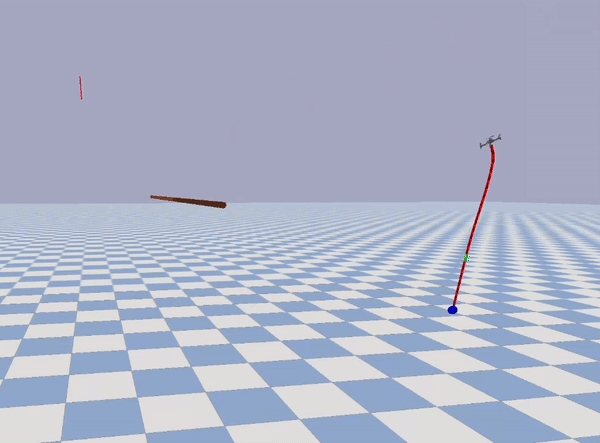                                                                                      |

## Factors Observed Influencing Perching Performance

Although the current testing shows promising results for the RL controller, perching success is not always guaranteed and can be affected by several factors. During the real-world experiments, we observed a clear influence of perching velocity, perching-weight mass, and the shape of the perching weight on the final outcome. The corresponding videos of these experiments can be found in the project video embeded in our [project webpage](https://kyrran.github.io/learning_agile_tensile_drone_perching_from_demo/).

### Velocity Effects

We conducted 19 experiments to test the effect of velocity, and 15 of them were successful. The agent used was SACfD **[A,A⁻]** with a perching weight of 10 g and a tether length of 1 m. Perching time limits were set to 0.6 s, 0.8 s, 1.0 s, 1.2 s, and 1.4 s, with roughly 20 waypoints per trajectory. This corresponds to control frequencies ranging from 14.3 Hz to 33.3 Hz.

After analysing all successful perching attempts, we found that the mean speed must stay within 1.90 m s⁻¹ and 2.07 m s⁻¹. When the average speed falls outside this window, perching failures begin to occur. Although the 0.6 s limit produced the highest peak speed, its mean speed was not the largest—likely because such a short window inevitably contains low-velocity acceleration and deceleration phases rather than sustained peak flight.

| Time limit | Success&nbsp;rate | Peak speed (m s⁻¹) | Mean speed (m s⁻¹) | Min & Max success speed (m s⁻¹) |
|:---------:|:----------------:|:------------------:|:------------------:|:------------------------------:|
| 0.6 s | 0 %   | 2.987 | 1.858 | — |
| 0.8 s | 66.7 %| 2.722 | 2.039 | 2.070 |
| 1.0 s | 100 % | 2.564 | 2.009 | — |
| 1.2 s | 100 % | 2.395 | 1.944 | 1.904 |
| 1.4 s | 0 %   | 2.249 | 1.825 | — |

Table shows the velocity effect on the SACfD **[A,A⁻]** perching performance (The “Min & Max” column records the minimal and maximal *mean* perching speed in the successful trials.)


### Perching-Weight Shape Effects

Smaller, smoother payloads reduce the likelihood of the payload striking the tether. In five consecutive runs of SACfD **[A,A⁻]** for each shape, the success rate dropped by 20 % when the payload was larger and more irregular. Tether strikes occurred in up to three out of five runs, often leading to failed wrapping.

### Perching-Weight Mass

We tested three payload masses—10 g, 20 g, and 30 g—using SACfD **[A,A⁻]** (1 m tether, minimal payload shape). As mass increased, success fell from 100 % at 10 g to 0 % at 20 g, and rose to 33.3 % at 30 g. Heavier loads often caused the drone to overshoot the target altitude, likely because extra thrust and torque were required, leading to controller overshoot. The single successful 30 g trial (with only one wrap) may have benefited from the added mass balancing the drone’s own weight; typically, two wraps are expected for a secure perch.


## PID Parameters

The PID parameters for the drone control are defined in `gym_pybullet_drones/control/DSLPIDControl.py` and are specific to the CF2X drone model used in this simulation. This model is from the ['gym_pybullet_drones'](https://github.com/utiasDSL/gym-pybullet-drones) project.

### Position Control (Force)
| Parameter | P | I | D |
|---|---|---|---|
| X | 0.4 | 0.05 | 0.2 |
| Y | 0.4 | 0.05 | 0.2 |
| Z | 1.25| 0.05 | 0.5 |

### Attitude Control (Torque)
| Parameter | P | I | D |
|---|---|---|---|
| Roll | 70000.0 | 0.0 | 20000.0 |
| Pitch| 70000.0 | 0.0 | 20000.0 |
| Yaw | 60000.0 | 500.0 | 12000.0 |

## Reward Visualisation 
### Reward $\mathbf{R}_{\text{approach}}$ Break-down

$\mathbf{R}{\text{approach}}$ is the sum of four terms – $r_{\text{proximity}}$, $r_{\text{endwaypoint}}$, $r_{\text{tether}}$, and $p_{\text{zone}}$. 

| 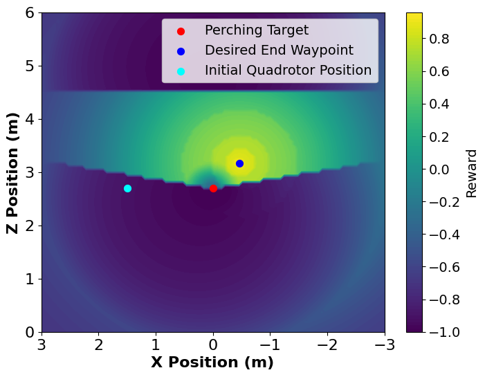 |
|:--:|
| **(a)** $\mathbf{R}_{\text{approach}}$: guides the drone to safely approach the branch (perching target), to prepare the best condition for the follow-up wrapping. |

| 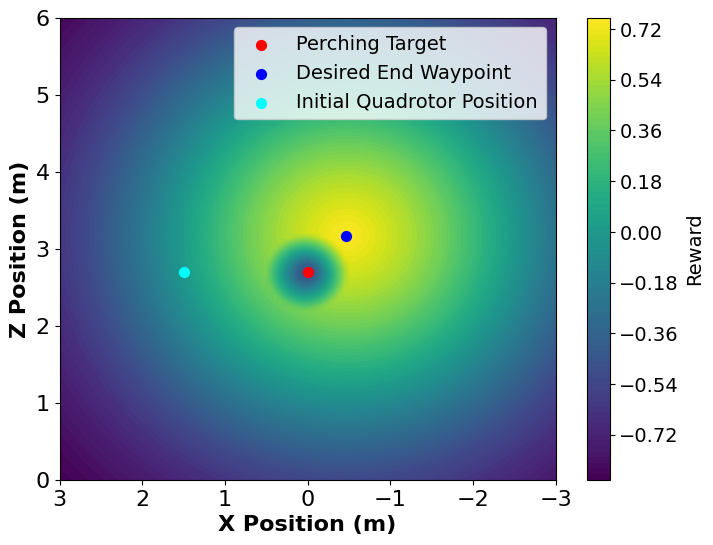 | 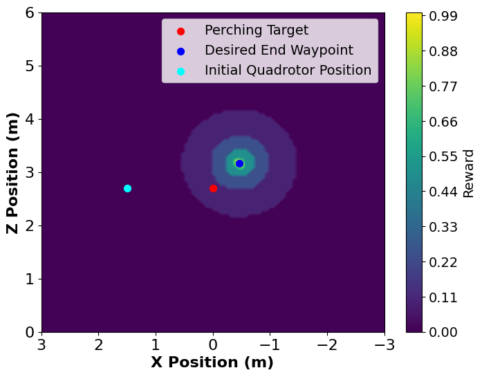 |
|:--:|:--:|
| **(b)** $r_{\text{proximity}}$: encourages the drone to move closer to the branch without collision. | **(c)** $r_{\text{endwaypoint}}$: rewards reaching the ideal final approaching waypoint that we blelive it has the best chance to wrap. |

| 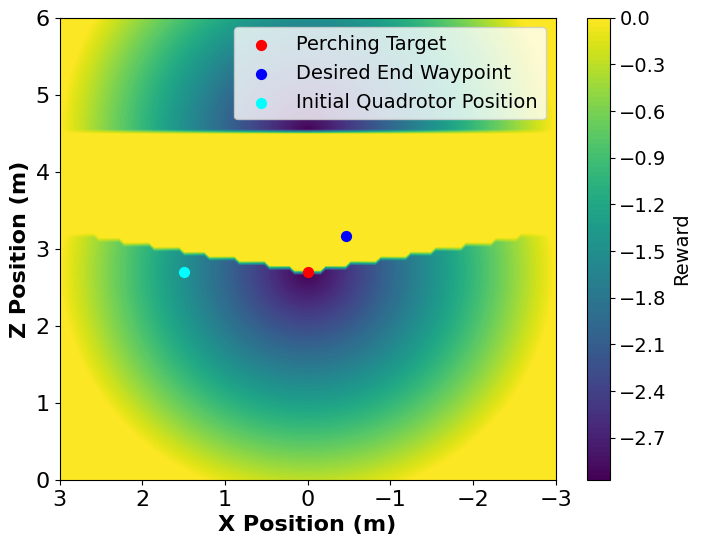 | 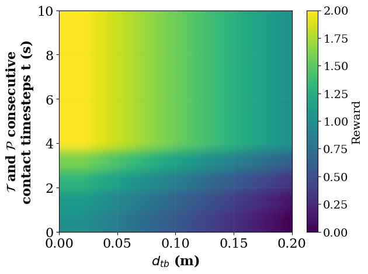 |
|:--:|:--:|
| **(d)** $p_{\text{zone}}$: penalises entry into undesirable regions that we think it's unnecessary to explore. | **(e)** $r_{\text{tether}}$: rewards consecutive tether contact with the branch |

### Reward $\mathbf{R}_{\text{wrap}}$ Visualisation
This reward encourages the tether to wrap around the branch, with a heuristic goal of achieving two wraps. 

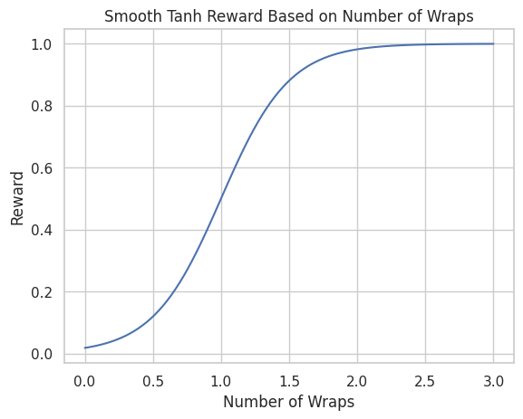 

### Reward $\mathbf{R}_{\text{hang}}$ Visualisation
The hanging reward function encourages the drone to reach a stable hanging position within a safe zone, defined by a box-shaped region around the optimal hanging point. The reward decays smoothly as the drone deviates from this zone. Upon the drone reaching this bounding box, the episode is terminated. 

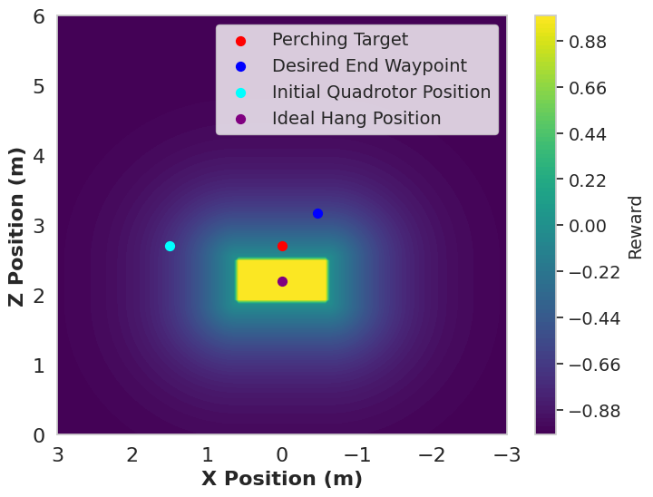 

### Reward $\mathbf{P}_{\text{collision}}$ Visualisation
This term softly penalizes the drone for being too close to the branch, at wrapping and hanging stage.

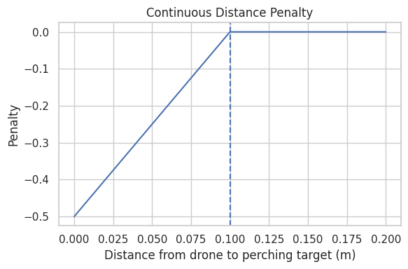 


## Thrust Comparision Between RL Agents
The thrust data were extracted from simulations conducted with a tether length of $1\text{m}$ and a payload mass of $6\times10^{-7}\,\text{kg}$. The plot presents the thrust profiles for all successful perching manoeuvres. We sampled one succesful trajectory per each agent. The success defined in the simulation involves observed wrapping, and the case when the failed wrapping is caused by payload hit the tether in the simulation but emperically it would wrap around in real-world experiments.

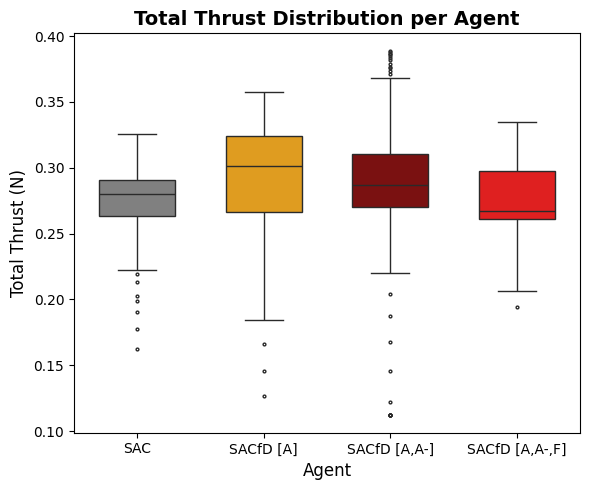 


## Acceleration Comparision Between RL Agents
The accelration data were extracted from rosbags recorded from real-world experiments in Aerial Robotics Lab, Imperial College London. All experiments were conducted with a tether length of 1 meter and a payload mass of 10 gram. The plot presents the accelaration profiles for each successful perching trajectory per each agent, in our real-world experiments. The success defined here means the proper wrapping was observed.

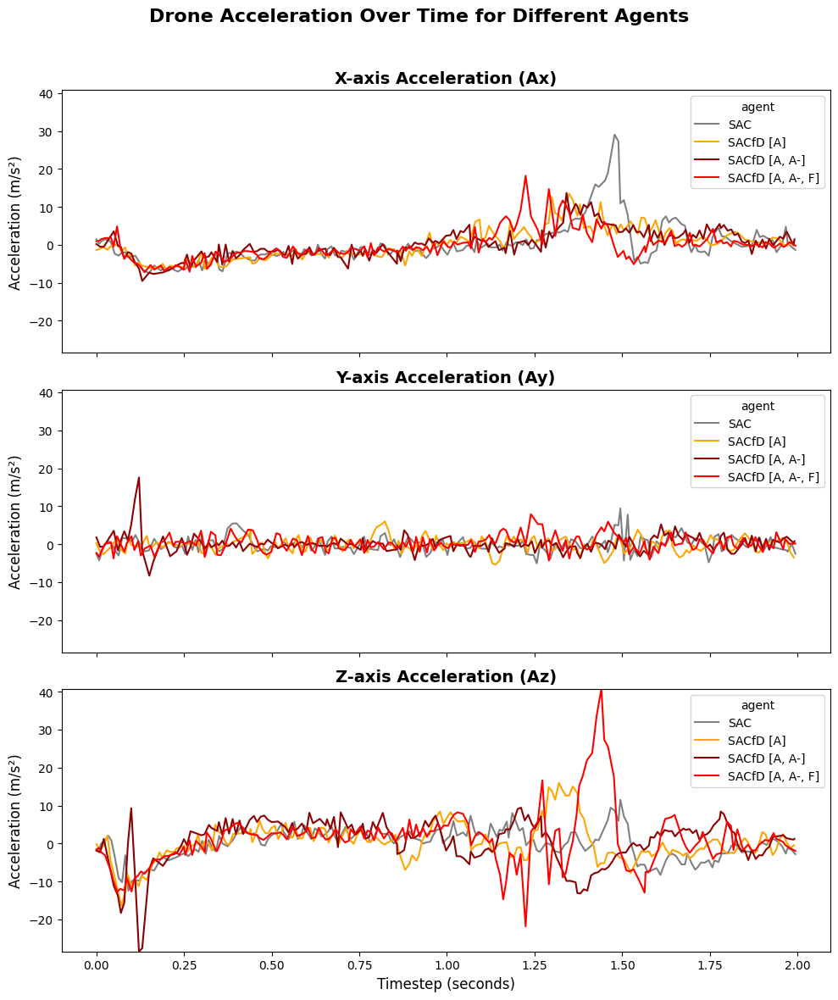 


## Reward over Different Training Steps
In earlier stages of training around 12k timesteps (40 episodes), all agents showed significant fluctuations in their reward curves, indicating instability and inconsistent learning. Such fluctuation suggests that the agents were still in the process of learning and had not yet converged to optimal policies.

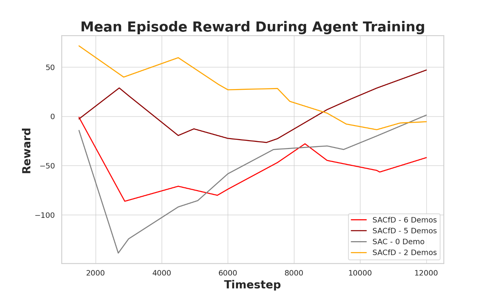

As training continued, around 120k timesteps (400 episodes), the agents showed improvement and started to stabilize. However, the reward curves do not fully converge at this point, except for the SACfD agent trained with 2 demonstrations. Despite the SACfD [A] (SACfD - 2 Demos) shows the convergence trend, the agent’s performance during simulation testing revealed some limitations. Based on the results from five runs starting from arbitrary points in the simulation, its perching maneuvers are risky, with the agent not learning a steady approach to the target. 

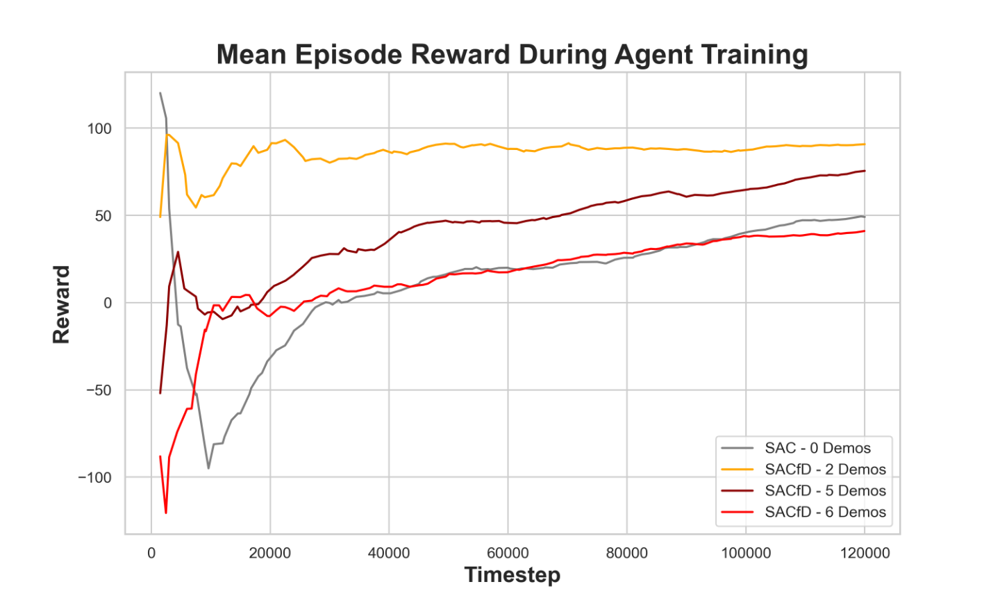

The performance after 1.2M timestep (around 4000 episodes) provided the most reliable results. All SACfD agents showed clear signs of convergence, and even the SAC agent appeared to stabilize early, though it might need more time to fully converge. The agents trained for this longer duration consistently achieved both stable and high rewards, highlighting how extended training plays a key role in maximizing performance and ensuring the agents are robust during testing. This is also the agent we use eveually to run all the experiments and testing in the paper.
 
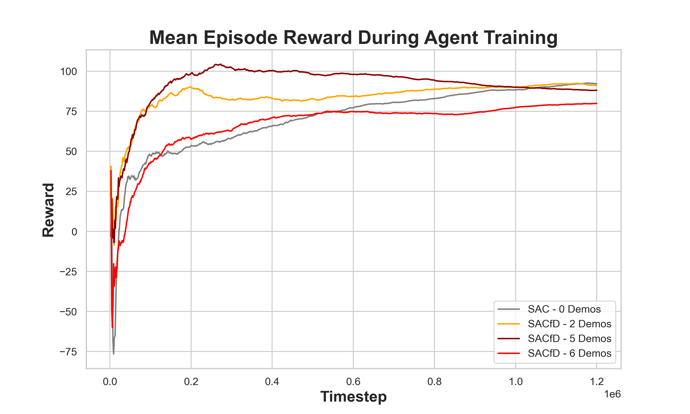 


                                             
## Future Work
- [ ] Investigate higher-level control strategies, such as velocity-based control, to enhance precision and performance beyond position control.
- [ ] Explore frameworks that directly integrate PyBullet with ROS2 for seamless simulation-to-reality transfer.
- [ ] Incorporate real-world physics elements, like wind and environmental disturbances, into the simulation to enhance realism and robustness.

- [ ] Future work will explore the stage after the drone powers off, either by modifying the hardware of the quadrotor, adding a loop around the main body to keep the drone remain upright after power-off, or involving human intervention to rescue the quadrotor. This reserve trajectory could be learned or computed. The structure could be referred to another work from the same lab [Aerial Tensile Perching and Disentangling Mechanism for Long-Term Environmental Monitoring](https://arxiv.org/abs/2403.01890)

## Code Reference
The following code files are from ['gym_pybullet_drones'](https://github.com/utiasDSL/gym-pybullet-drones) project, with or without our own modification to suit specific project needs.

```
assets/cf2.dae
assets/cf2x.urdf

control/BaseControl.py
control/DSLPIDControl.py

envs/BaseAviary.py
envs/TetherModelSimulationEmvPID.py #contains code from gym_pybullet_drones project

utils/enums.py
utils/utils.py
```

The following code files are from the [previous paper](https://ieeexplore.ieee.org/document/10161135), serving as the baseline in our paper work. A few modification were made to suit our project needs. 

```
main/simple_baselibe_code/previousPaperCode/createTrajectorTXTfile.py
main/simple_baselibe_code/previousPaperCode/plotTargetedTijectory.py
```

The following heatmap shows the velocity magnitudes during the perching trajectory. This trajectory is generated using an approach from previous work.

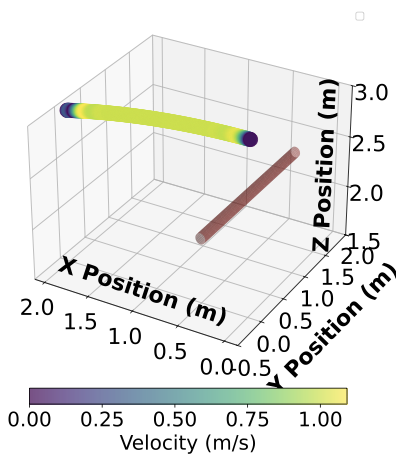 


## Troubleshooting

- If conda / miniconda is used, please edit .bashrc with these commands, either add or delete, whichever it works.

```
export MESA_GL_VERSION_OVERRIDE=3.2
export MESA_GLSL_VERSION_OVERRIDE=150
```
or 
```
export LD_PRELOAD=/usr/lib/x86_64-linux-gnu/libstdc++.so.6
```


- Sometimes, this method can also work:
```
conda install -c conda-forge libgcc=5.2.0
conda install -c anaconda libstdcxx-ng
conda install -c conda-forge gcc=12.1.0
```


## References

- Jacopo Panerati and Hehui Zheng and SiQi Zhou and James Xu and Amanda Prorok and Angela P. Schoellig (2021) [*Learning to Fly---a Gym Environment with PyBullet Physics for Reinforcement Learning of Multi-agent Quadcopter Control*](https://arxiv.org/abs/2103.02142) 
- Antonin Raffin, Ashley Hill, Maximilian Ernestus, Adam Gleave, Anssi Kanervisto, and Noah Dormann (2019) [*Stable Baselines3*](https://github.com/DLR-RM/stable-baselines3)
- F. Hauf et al., [*Learning Tethered Perching for Aerial Robots*](https://ieeexplore.ieee.org/document/10161135) 2023 IEEE International Conference on Robotics and Automation (ICRA), London, United Kingdom, 2023, pp. 1298-1304, doi: 10.1109/ICRA48891.2023.10161135.


